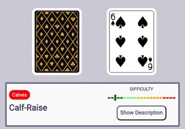

# CARDio

 

This project was generated with [Angular CLI](https://github.com/angular/angular-cli) version 11.2.1.

## [Live Demo](https://cardio.surge.sh/)

### Description

Starting with a large list of exercises users can filter the exercises by difficulty, targeted muscle groups and by name, making it inclusive for people with varying levels of experience.

Users can put themselves to the test and choose up to ten exercises to be included in the applications workout game. The game involves a deck of cards and with each draw of a card the user gets one of their ten chosen exercises and the amount of reps to perform, based on the drawn card. Race against the clock and try to get through the whole deck.

### How To Play

Look through our list of exercises and choose up to 10 to be included in your workout game. You have the choice to either:

1. Play with the exercises of your choice.
2. Let CARDio randomly generate exercises for you.
3. Choose between a lower body, upper body, core or full body workout, and CARDio will pick the exercises for you.

To start the game, click on the deck of cards and a card will be flipped over with one of your chosen exercises displayed beneath it. The card indicates how many reps you will do for that specfic exercise. For example:

In this case, you will do 6 reps of Calf Raises. Face cards have a value of 10 reps, and Aces have a value of 1 rep. If you need a refresher on how to do an exercise, press the "Show Description" button for an explanation.

When you finish your reps for that exercise, click the deck of cards to display your next exercise. The goal is to get through all 52 cards, but you can stop whenever you'd like and press the "Finish Workout" button.

## About the creators of CARDio

We are Front End Bootcamp graduates at Grand Circus in Detroit, MI and the creators of CARDio. We created this app because we want to give every person a tool to take their health and liveliness, specifically during this pandemic, into their own hands.

[Tara Cuckovich](https://github.com/taracuck)

[Richard McIntosh](https://github.com/richmister)

[Jeff Johnston](https://github.com/Jeffrey-Johnston)
